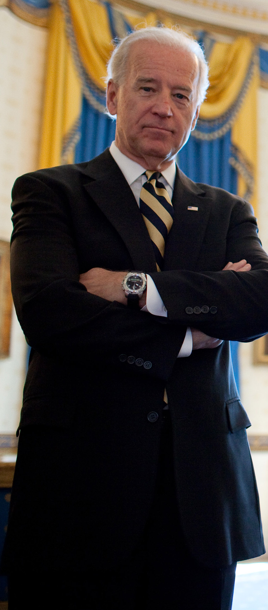
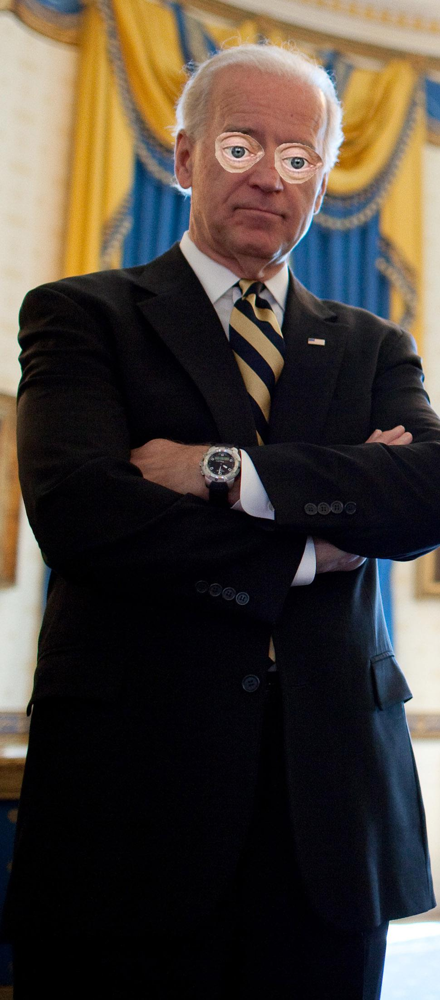

buscemizer
==========

Description
-----------

Add Steve Buscemi's beautiful facial features to facial photos!

Requirements
------------

* Python 3.6+
* `facial-recognition <https://github.com/ageitgey/face_recognition>`_
* pillow
* numpy

Installation
------------

buscemizer can be installed via pip:

.. code-block:: console

    pip install buscemizer

Usage
-----

After installing buscemizer it can be executed from the command line:

.. code-block:: console

    buscemizer <path to image to have Steve Buscemi's beautiful facial features added to>

For additional help in using buscemizer run the following command:

.. code-block:: console

    buscemizer --help

Example
-------

As an example lets buscemize Joe Biden.

To do such we run the following command:

.. code-block:: console

    buscemizer examples/biden.jpg

After the buscemizing is completed, a ``biden-buscemi.jpg`` file will be
created within the current working directory.

If everything goes well it should look something like this...

